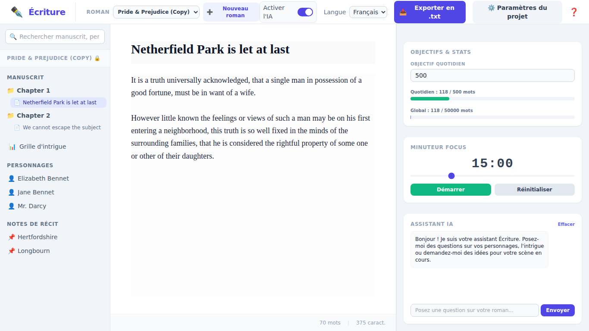
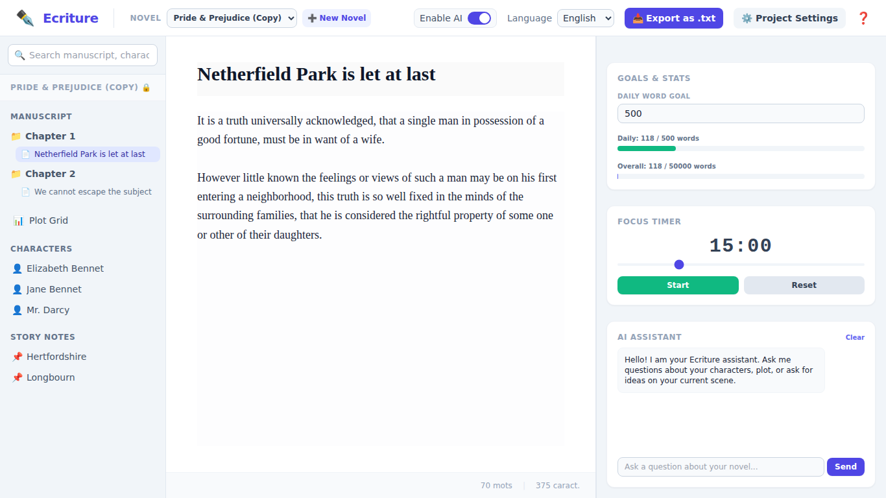
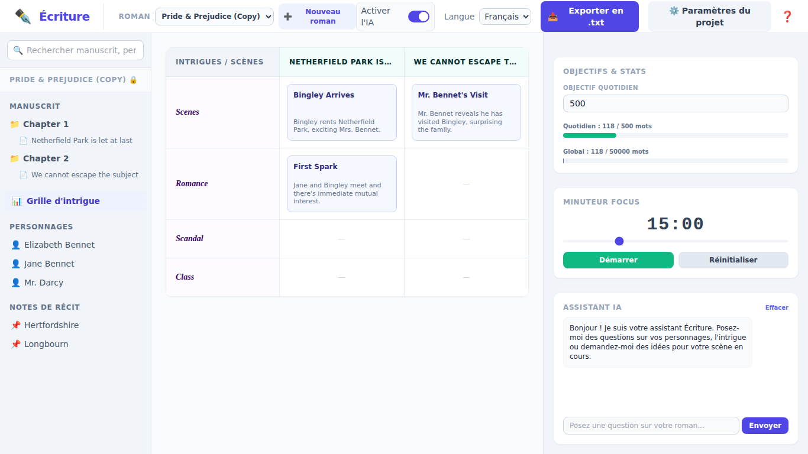

# Écriture - Outil d'aide à la rédaction de romans / Novel Writing Assistant

*Créé par Martial Limousin - 2026.*
*Licence libre CeCILL / CeCILL Free Software License Agreement ([http://www.cecill.info](http://www.cecill.info/licences/Licence_CeCILL_V2.1-fr.html)).*

---

## 🌍 Langues / Languages
* [Français (French)](#français)
* [English (Anglais)](#english)

---

<div id="français"></div>

# version française 🇫🇷

**Écriture** est une application web de bureau élégante, moderne et sans distraction conçue en Python (Flask) et JavaScript (Tailwind CSS) pour aider les écrivains à planifier, structurer et rédiger leurs romans. Inspirée de la philosophie de conception de DabbleWriter, cette application intègre tous les outils indispensables aux romanciers au sein d'une interface unifiée, réactive et bilingue.

## 📸 Aperçus de l'Application

### Interface Principale (Français)


### Interface Principale (English)


### Grille d'Intrigue (Plot Grid)


### Verrouillage du Roman (Lecture seule)


---

## ✨ Fonctionnalités Clés

*   **Éditeur de Texte Minimaliste & Distraction-Free** : Conçu pour optimiser la concentration avec des polices élégantes (Georgia), des marges de lecture parfaites et une sauvegarde automatique et silencieuse à chaque frappe.
*   **Arbre de Navigation Interactif** : Gérez de manière hiérarchique vos chapitres, scènes, fiches de personnages et notes de récit dans la barre latérale gauche. Ordonnez et renommez vos éléments d'un simple clic.
*   **Grille d'Intrigue (Plot Grid)** : Un tableau de planification interactif pour cartographier vos intrigues secondaires et chapitres, inspiré de la méthode Snowflake.
*   **Suivi des Objectifs & Statistiques** : Fixez des objectifs quotidiens et globaux. Des barres de progression interactives calculent vos mots en temps réel.
*   **Minuteur de Focus (Focus Timer)** : Un minuteur Pomodoro réglable intégré pour rythmer vos sessions d'écriture intensives.
*   **Assistant IA Local (Optionnel)** : Un volet d'assistant IA qui se connecte de manière transparente à votre serveur local **Ollama** (port 11434). L'assistant IA peut être complètement désactivé/masqué d'un simple clic via un interrupteur dans l'en-tête, préservant votre espace de travail.
*   **Internationalisation Dynamique** : Basculez instantanément toute l'interface entre le **Français** et l'**Anglais** sans aucun rechargement de page.
*   **Sécurité & Verrouillage** : Verrouillez vos romans pour empêcher toute modification accidentelle (mode lecture seule avec badges visuels de verrouillage).
*   **Export Structuré** : Compilez et exportez l'intégralité de votre manuscrit structuré en un fichier `.txt` propre en un clic.

---

## 🛠️ Technologies Utilisées

*   **Backend** : Python 3, Flask.
*   **Stockage des Données** : Format JSON structuré (`projects/` directory) géré par un module de gestion robuste (`project_manager.py`).
*   **Frontend** : HTML5, Tailwind CSS, JavaScript moderne (Vanilla JS, Single Page Application).
*   **Localisation** : Fichiers de traduction externes JSON (`locales/fr.json`, `locales/en.json`) pour un découplage total.

---

## 🚀 Installation & Lancement

### Prérequis
*   **Python 3.8** ou supérieur installé.

### Étape 1 : Cloner ou extraire le projet
Placez-vous dans le répertoire racine du projet.

### Étape 2 : Créer et activer un environnement virtuel
Sur **macOS / Linux** :
```bash
python3 -m venv venv
source venv/bin/activate
```
Sur **Windows** :
```cmd
python -m venv venv
venv\Scripts\activate
```

### Étape 3 : Installer les dépendances
Installez Flask :
```bash
pip install flask
```

### Étape 4 : Lancer le serveur d'application
```bash
python main.py
```

### Étape 5 : Accéder à l'application
Ouvrez votre navigateur web et accédez à :
👉 **[http://localhost:5000](http://localhost:5000)**

---

## 📝 Guide d'Utilisation

1.  **Création de Roman** : Cliquez sur le bouton **"+" Nouveau roman** dans l'en-tête pour créer instantanément un nouveau projet.
2.  **Rédaction** : Sélectionnez n'est-ce pas un élément (Chapitre ou Scène) dans la barre latérale pour commencer à taper dans l'éditeur central. La sauvegarde est automatique !
3.  **Grille d'Intrigue** : Cliquez sur **Grille d'intrigue** dans l'arbre pour afficher le tableau de planification. Cliquez sur une cellule pour y ajouter ou modifier une carte de l'intrigue.
4.  **Bouton IA** : Activez ou désactivez l'Assistant IA à l'aide de l'interrupteur **Activer l'IA** dans la barre supérieure.
5.  **Paramètres de Projet** : Cliquez sur **Paramètres du projet** pour changer le titre, définir l'objectif de mots global, verrouiller/déverrouiller le roman, ou le supprimer.

---

<div id="english"></div>

# ENGLISH VERSION 🇬🇧

**Écriture** is an elegant, modern, and distraction-free desktop web application built with Python (Flask) and JavaScript (Tailwind CSS) designed to assist writers in planning, structuring, and drafting their novels. Inspired by DabbleWriter’s clean philosophy, this application combines essential novel-writing tools in a single-page responsive, bilingual interface.

## 📸 Application Screenshots

### Main Workspace (French)


### Main Workspace (English)


### Plot Grid View


### Locked Novel View (Read-Only)


---

## ✨ Key Features

*   **Distraction-Free Text Editor**: Designed to maximize focus with gorgeous typography (Georgia), optimal margins, and silent automatic saving on every keystroke.
*   **Interactive Navigation Tree**: Hierarchical management of chapters, scenes, characters, and notes in the left sidebar. Edit, rename, or delete elements instantly.
*   **Plot Grid**: An interactive planning board to map out your subplots and chapters, inspired by the Snowflake method.
*   **Goals & Statistics Tracker**: Define daily and overall word count goals. Real-time progress bars calculate counts dynamically as you write.
*   **Focus Timer**: Built-in adjustable Pomodoro timer to pace your writing sprints.
*   **Local AI Assistant (Optional)**: An AI assistant panel that connects seamlessly to your local **Ollama** server (port 11434). The AI assistant can be completely disabled/hidden with a simple header switch, ensuring a completely offline and distraction-free environment.
*   **Dynamic Localization**: Change the entire interface language instantly between **English** and **French** with zero page reloads.
*   **Workspace Security**: Lock your novel to prevent accidental edits (read-only mode with clear visual indicator badges).
*   **Structured Export**: Export and compile your entire structured novel into a clean, plain `.txt` file with one click.

---

## 🛠️ Built With

*   **Backend**: Python 3, Flask.
*   **Data Storage**: Structured JSON formatted projects (saved under `/projects/` directory) powered by a robust backend manager (`project_manager.py`).
*   **Frontend**: HTML5, Tailwind CSS, Modern JavaScript (Vanilla JS, Single Page Application style).
*   **Localization**: Decoupled external translation files (`locales/fr.json`, `locales/en.json`).

---

## 🚀 Setup & Installation

### Prerequisites
*   **Python 3.8** or higher installed.

### Step 1: Clone or extract the project files
Navigate to the project root directory.

### Step 2: Create and activate a virtual environment
On **macOS / Linux**:
```bash
python3 -m venv venv
source venv/bin/activate
```
On **Windows**:
```cmd
python -m venv venv
venv\Scripts\activate
```

### Step 3: Install dependencies
Install Flask:
```bash
pip install flask
```

### Step 4: Run the application server
```bash
python main.py
```

### Step 5: Access the application
Open your favorite web browser and go to:
👉 **[http://localhost:5000](http://localhost:5000)**

---

## 📝 User Guide

1.  **Creating Novels**: Click the **"+" New novel / Nouveau roman** button in the top bar to create a fresh project.
2.  **Drafting**: Click any Chapter or Scene in the navigation tree to open the distraction-free editor. Start writing; your work is auto-saved as you type.
3.  **Plotting**: Access the **Plot Grid** from the sidebar to map your plot structure. Click empty cells to add plot cards or click existing cards to edit their summary.
4.  **AI Toggle**: Turn the AI assistant on or off using the **Toggle AI / Activer l'IA** switch in the top header.
5.  **Project Settings**: Adjust project titles, overall word goals, lock/unlock the workspace, or delete the current novel via the **Project settings** modal.
