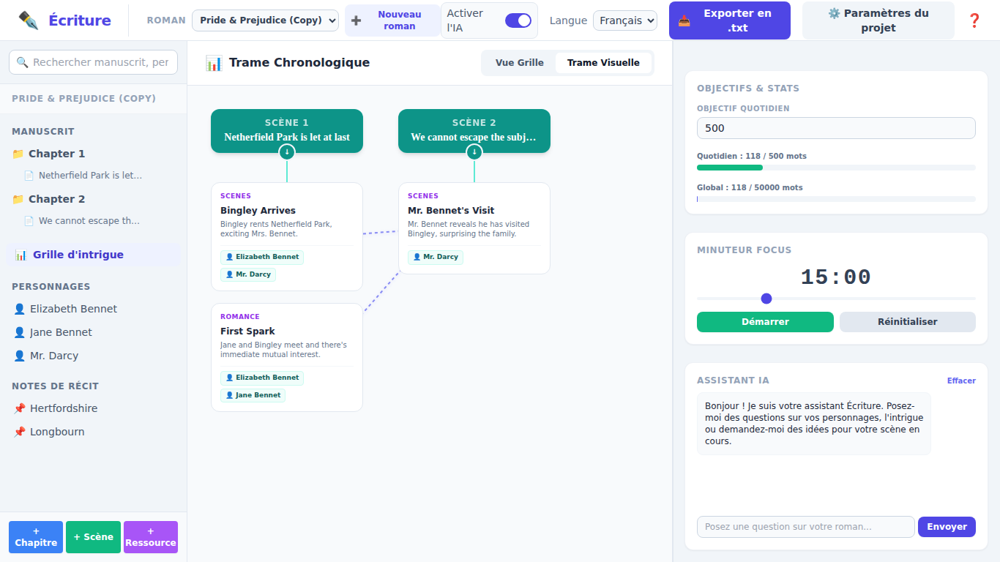

# Écriture - Outil d'aide à la rédaction de romans / Novel Writing Assistant

*Écrire, partager, transmettre sont des droits fondamentaux. 
*Créé par Martial Limousin - 2026.*
*Licence libre CeCILL / CeCILL Free Software License Agreement ([http://www.cecill.info](http://www.cecill.info/licences/Licence_CeCILL_V2.1-fr.html)).*

---

## 🌍 Langues / Languages
* [Français (French)](#français)
* [English (Anglais)](#english)

---

<div id="français"></div>

# version française 🇫🇷

**Écriture** est une application web de bureau élégante, moderne et sans distraction conçue en Python (Flask) et JavaScript (Tailwind CSS) pour aider les écrivains à planifier, structurer et rédiger leurs romans. Cette application intègre tous les outils indispensables aux romanciers au sein d'une interface unifiée, réactive et bilingue.

## 📸 Aperçus de l'Application

### Interface Principale (Français)


### Interface Principale (English)


### Grille d'Intrigue (Plot Grid - Vue Table)


### Trame Visuelle Chronologique (Timeline & Liaisons)


### Verrouillage du Roman (Lecture seule)


---

## ✨ Fonctionnalités Clés

*   **Éditeur de Texte Minimaliste & Distraction-Free** : Conçu pour optimiser la concentration avec des polices élégantes (Georgia), des marges de lecture parfaites et une sauvegarde automatique et silencieuse à chaque frappe.
*   **Arbre de Navigation Interactif** : Gérez de manière hiérarchique vos chapitres, scènes, fiches de personnages et notes de récit dans la barre latérale gauche. Ordonnez et renommez vos éléments d'un simple clic.
*   **Fiches Personnages & Lore de Récit** : Créez des profils détaillés avec pseudonymes/alias, traits de caractère, apparence et notes biographiques. Créez des cartes de relations dynamiques entre personnages et associez-les directement aux scènes via des listes d'apparition interactives. Le lore pertinent est automatiquement injecté dans l'IA pour préserver la cohérence de vos textes.
*   **Écriture IA Contextuelle & Sélection de Texte** : Un menu contextuel intelligent apparaît sous votre sélection de texte. Utilisez les outils *Décrire*, *Réécrire* (avec styles élégant, argotique, poétique, brutal, cynique), *Développer*, ou *Point de Vue (POV)* (1ère personne, 3ème personne, témoin) avec insertion directe, régénération ou annulation.
*   **Brainstorming & Déblocage Créatif** : Une boîte à "Idées" dédiée génère 3 complications narratives pour relancer une scène enlisée ou génère des noms et toponymes cohérents selon les racines linguistiques de votre univers.
*   **Assistant de Chat IA Intelligent** : Chattez avec un assistant d'écriture persistant dans le volet droit. L'application utilise une IA embarquée totalement déconnectée d'internet (Gemma 4) fonctionnant 100% en local.
*   **Personnalisation des paramètres IA** : Ajustez la température de créativité (de 0.0 à 1.0) et gérez les modèles d'IA locaux directement depuis les paramètres du projet.
*   **Grille d'Intrigue & Trame Chronologique Visuelle** : Un espace de planification interactif à double affichage. Alterner entre la **Vue Grille** classique (tableau d'intrigue inspiré de la méthode Snowflake) et la **Trame Visuelle** (frise chronologique horizontale). Reliez graphiquement vos cartes d'intrigue entre elles par des lignes de flux dynamiques (courbes de Bézier SVG) et associez-y vos personnages pour visualiser la structure de votre roman.
*   **Exportation Multi-Formats Professionnelle** : Compilez et exportez l'intégralité de votre roman structuré en un clic vers six formats populaires : Word (`.docx`), PDF (`.pdf`), OpenDocument (`.odt`), ePub (`.epub`), Mobipocket (`.mobi`) ou texte brut (`.txt`).
*   **Suivi des Objectifs & Statistiques** : Fixez des objectifs quotidiens et globaux. Des barres de progression interactives calculent vos mots en temps réel.
*   **Minuteur de Focus (Focus Timer)** : Un minuteur Pomodoro réglable intégré pour rythmer vos sessions d'écriture intensives.
*   **Barre Assistante Redimensionnable** : Ajustez facilement la largeur du panneau droit à l'aide d'une poignée de redimensionnement réactive, avec persistance automatique de la taille choisie.
*   **Internationalisation Dynamique** : Basculez instantanément toute l'interface entre le **Français** et l'**Anglais** sans aucun rechargement de page.
*   **Sécurité & Verrouillage** : Verrouillez vos romans pour empêcher toute modification accidentelle (mode lecture seule avec badges visuels de verrouillage).

---

## 🛠️ Technologies Utilisées

*   **Backend** : Python 3, Flask.
*   **Exportations** : Python-docx, ReportLab (PDF), formatage de paquets zip binaires natifs pour ODT, ePub, et Mobipocket.
*   **Données Lexicales & Synonymes** : Intègre la base de données Lexique.org pour la lemmatisation automatique ainsi que la ressource sémantique libre [WOLF](https://almanach.inria.fr/software_and_resources/WOLF-en.html) (Wordnet Libre du Français, développé par l'ALMAnaCH à l'Inria) pour une recherche de synonymes riche et contextuelle.
*   **Stockage des Données** : Format JSON structuré (`projects/` directory) géré par un module de gestion robuste (`project_manager.py`).
*   **Frontend** : HTML5, Tailwind CSS, JavaScript moderne (Vanilla JS, Single Page Application).
*   **Localisation** : Fichiers de traduction externes JSON (`locales/fr.json`, `locales/en.json`) pour un découplage total.

---

## 📥 Téléchargement

Les versions exécutables prêtes à l'emploi (Windows, macOS, Linux) sont disponibles sur la page des releases :
👉 **[https://github.com/neomars/ecriture/releases](https://github.com/neomars/ecriture/releases)**

---

## 🚀 Installation des fichiers source (pour utilisateur averti)

### Prérequis
*   **Python 3.8** ou supérieur installé.

### Étape 1 : Cloner ou extraire le projet
Placez-vous dans le répertoire racine du projet.

### Étape 2 : Créer et activer un environnement virtuel
Sur **macOS / Linux** :
```bash
python3 -m venv venv
source venv/bin/activate
```
Sur **Windows** :
```cmd
python -m venv venv
venv\Scripts\activate
```

### Étape 3 : Installer les dépendances
Installez les dépendances nécessaires au fonctionnement et à l'export :
```bash
pip install -r requirements.txt
```

### Étape 4 : Lancer le serveur d'application
```bash
python main.py
```

### Étape 5 : Accéder à l'application
Ouvrez votre navigateur web et accédez à :
👉 **[http://localhost:5000](http://localhost:5000)**

---

## 📝 Guide d'Utilisation

1.  **Création de Roman** : Cliquez sur le bouton **"+" Nouveau roman** dans l'en-tête pour créer instantanément un nouveau projet.
2.  **Rédaction & IA Contextuelle** : Sélectionnez une Scène pour commencer à taper dans l'éditeur. Surlignez n'importe quel texte pour voir apparaître le menu d'outils d'écriture IA contextuels.
3.  **Fiches Personnages & Lore** : Ajoutez des fiches de personnages et associez-les à vos scènes. Définissez leurs caractéristiques, ainsi que leurs relations dynamiques.
4.  **Grille d'Intrigue & Trame Visuelle** : Cliquez sur **Grille d'intrigue** dans l'arbre pour afficher l'espace de planification. Utilisez les onglets **Vue Grille** et **Trame Visuelle** pour alterner entre le tableau et la frise chronologique interactive. Associez des personnages et connectez des cartes entre elles via des lignes de flux graphiques directement depuis le formulaire d'édition d'une carte.
5.  **Bouton IA** : Activez ou désactivez l'Assistant IA à l'aide de l'interrupteur **Activer l'IA** dans la barre supérieure. Lors de la première utilisation, si l'IA locale n'est pas installée et que votre système possède au moins 12 Go de RAM et 5 Go de stockage libre, l'application peut télécharger automatiquement le modèle par défaut **Gemma 4** fonctionnant en local, sans logiciel tiers.
6.  **Paramètres de Projet** : Cliquez sur **Paramètres du projet** pour changer le titre, définir l'objectif de mots global, verrouiller/déverrouiller le roman, ajuster la température de l'IA, gérer les modèles locaux, ou supprimer le roman.

---

<div id="english"></div>

# ENGLISH VERSION 🇬🇧

**Écriture** is an elegant, modern, and distraction-free desktop web application built with Python (Flask) and JavaScript (Tailwind CSS) designed to assist writers in planning, structuring, and drafting their novels. This application combines essential novel-writing tools in a single-page responsive, bilingual interface.

## 📸 Application Screenshots

### Main Workspace (French)


### Main Workspace (English)


### Plot Grid View (Classic Table Grid)


### Visual Chronological Timeline (Connections & Flow)


### Locked Novel View (Read-Only)


---

## ✨ Key Features

*   **Distraction-Free Text Editor**: Designed to maximize focus with gorgeous typography (Georgia), optimal margins, and silent automatic saving on every keystroke.
*   **Interactive Navigation Tree**: Hierarchical management of chapters, scenes, characters, and notes in the left sidebar. Edit, rename, or delete elements instantly.
*   **Rich Character Profiles & Story Lore**: Create detailed character profiles with aliases, traits, physical appearance, and background notes. Define dynamic relationship grids and link characters directly to scene checklists. Character details and notes context are automatically injected into AI prompts for seamless consistency.
*   **Contextual AI Writing Menu**: Select any text in the editor to bring up a floating smart caret menu. Use tools like *Describe*, *Rewrite* (with elegant, slang, poetic, brutal, and cynical style presets), *Expand*, or *Point of View (POV)* shifts (1st person, 3rd person, external witness) with support for direct replacements, regeneration, and fine-tuning.
*   **Brainstorming & Creative Unblocking**: A dedicated "Ideas" modal analyzes your stuck scene to generate 3 coherent narrative complications to restart the action, or generates contextual names and toponyms respecting your world's linguistic roots.
*   **Smart AI Chat Assistant**: Chat with a persistent writing companion in the right-hand sidebar. The application uses a fully offline embedded local AI (Gemma 4) operating 100% locally on your machine.
*   **Customizable AI Parameters**: Adjust the AI creativity temperature (from 0.0 to 1.0) and manage local AI models from the Project Settings panel.
*   **Plot Grid & Visual Chronological Timeline**: A dual-view interactive plotting workspace. Switch seamlessly between the classic **Grid View** (table layout inspired by the Snowflake method) and the **Visual Timeline** (horizontal flowchart). Graphically connect plot cards with dynamic SVG flowlines, and link characters directly to cards to visually track story flow.
*   **Professional Multi-Format Document Export**: Compile and export your entire structured novel instantly with one click into six popular formats: Word (`.docx`), PDF (`.pdf`), OpenDocument (`.odt`), ePub (`.epub`), Mobipocket (`.mobi`), or plain text (`.txt`).
*   **Goals & Statistics Tracker**: Define daily and overall word count goals. Real-time progress bars calculate counts dynamically as you write.
*   **Focus Timer**: Built-in adjustable Pomodoro timer to pace your writing sprints.
*   **Resizable Assistant Sidebar**: Easily adjust the width of the right panel using a responsive drag handle, with automatic local width persistence.
*   **Dynamic Localization**: Change the entire interface language instantly between **English** and **French** with zero page reloads.
*   **Workspace Security**: Lock your novel to prevent accidental edits (read-only mode with clear visual indicator badges).

---

## 🛠️ Built With

*   **Backend**: Python 3, Flask.
*   **Exports**: Python-docx, ReportLab (PDF), native zip structural stream packets for ODT, ePub, and Mobipocket.
*   **Lexical Data & Synonyms**: Integrates Lexique.org database for automatic lemmatization and the free French wordnet [WOLF](https://almanach.inria.fr/software_and_resources/WOLF-en.html) (Wordnet Libre du Français, developed by ALMAnaCH at Inria) for rich and contextual synonyms lookup.
*   **Data Storage**: Structured JSON formatted projects (saved under `/projects/` directory) powered by a robust backend manager (`project_manager.py`).
*   **Frontend**: HTML5, Tailwind CSS, Modern JavaScript (Vanilla JS, Single Page Application style).
*   **Localization**: Decoupled external translation files (`locales/fr.json`, `locales/en.json`).

---

## 📥 Download

Ready-to-use executable releases (Windows, macOS, Linux) are available on the releases page:
👉 **[https://github.com/neomars/ecriture/releases](https://github.com/neomars/ecriture/releases)**

---

## 🚀 Setup & Installation

### Prerequisites
*   **Python 3.8** or higher installed.

### Step 1: Clone or extract the project files
Navigate to the project root directory.

### Step 2: Create and activate a virtual environment
On **macOS / Linux**:
```bash
python3 -m venv venv
source venv/bin/activate
```
On **Windows**:
```cmd
python -m venv venv
venv\Scripts\activate
```

### Step 3: Install dependencies
Install Flask and export dependencies:
```bash
pip install -r requirements.txt
```

### Step 4: Run the application server
```bash
python main.py
```

### Step 5: Access the application
Open your favorite web browser and go to:
👉 **[http://localhost:5000](http://localhost:5000)**

---

## 📝 User Guide

1.  **Creating Novels**: Click the **"+" New novel / Nouveau roman** button in the top bar to create a fresh project.
2.  **Drafting & Contextual AI**: Click any Scene in the navigation tree to open the editor. Highlight any text block to trigger floating smart AI writing tools.
3.  **Characters & Lore**: Manage full character bios, dynamic relationship networks, and appearances. Check occurrences to link characters to specific scenes.
4.  **Plotting & Timeline**: Access the **Plot Grid** from the sidebar. Toggle between **Grid View** and **Visual Timeline** tabs. Link characters and draw graphical connection flowlines between plot cards directly from the card edit popup to map your story's chronological flow simply.
5.  **AI Toggle**: Turn the AI assistant on or off using the **Toggle AI / Activer l'IA** switch in the top header. On first use, if the local AI model is missing and your system meets the requirements (12GB RAM, 5GB free disk space), you will be prompted to automatically download the embedded **Gemma 4** model directly.
6.  **Project Settings**: Adjust project titles, overall word goals, lock/unlock the workspace, customize AI parameters (temperature, model selection), or delete the current novel via the **Project settings** modal.
