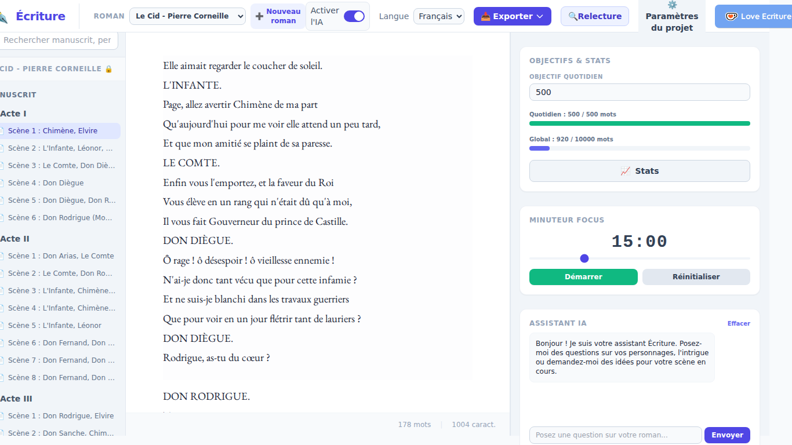
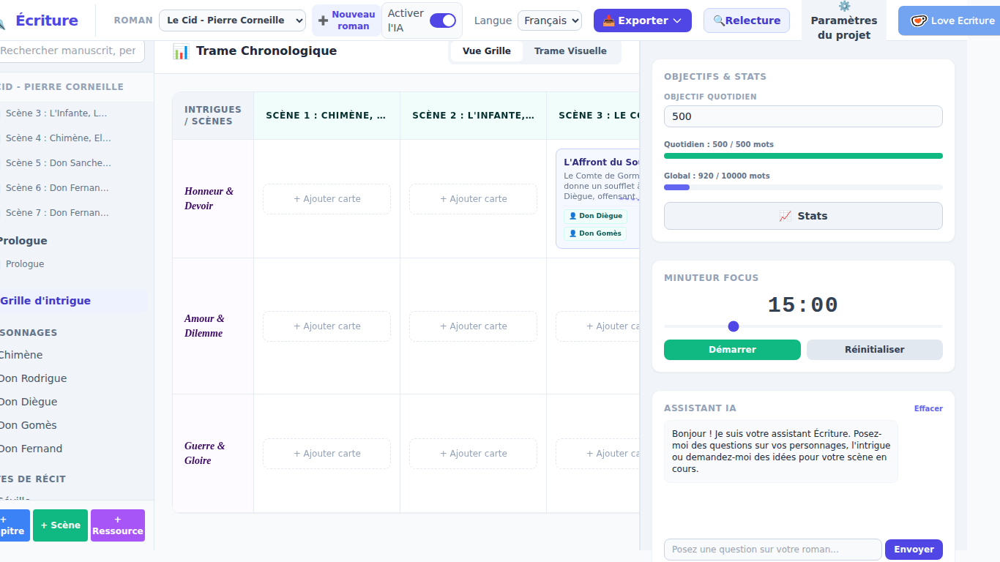
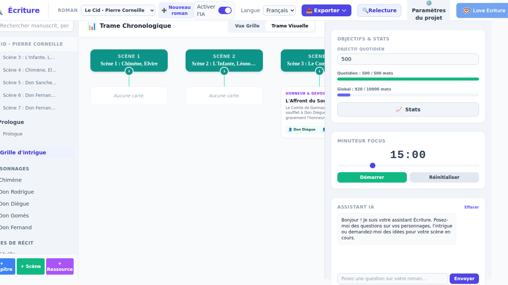

# Écriture

**🇫🇷 [Français](#-français) · 🇬🇧 [English](#-english)**


---

## 🇫🇷 Français

Écriture est un logiciel de traitement de texte conçu pour les romanciers et les auteurs. Il réunit en une seule application le manuscrit, la planification de l'intrigue, les fiches personnages et une intelligence artificielle **100 % locale** : vos textes ne quittent jamais votre ordinateur.

Cette version est une réécriture complète en **Rust** (avec **Tauri** pour l'interface) de l'application Python d'origine : elle démarre plus vite, consomme moins de mémoire et s'installe comme un logiciel classique, sans Python à installer.

### Fonctionnalités principales

#### ✍️ Rédaction
- **Éditeur de manuscrit** en défilement continu, avec gras, italique, petites capitales, mise en forme des dialogues, annotations, sauts de page et numéros de page.
- **Mise en page réglable** : police, taille, interligne, texte aligné à gauche ou justifié.
- **Compteur de mots et de caractères** en temps réel, et **enregistrement automatique**.
- **Recherche globale** dans le manuscrit, les personnages et les notes.
- **Synonymes** : sélectionnez un mot puis cliquez sur « Synonymes ». Dictionnaires **français** et **anglais** intégrés, qui fonctionnent hors ligne. Le dictionnaire anglais reconnaît aussi les formes conjuguées et les pluriels (*walked*, *went*, *ladies*…).
- **Verrouillage du roman** (lecture seule) pour éviter toute modification involontaire.

#### 🗂️ Organisation du roman
- **Plusieurs romans** : créez, renommez, supprimez et passez d'un projet à l'autre. Deux romans complets sont fournis en exemple, avec leurs personnages, intrigues et lieux : *Le Comte de Monte-Cristo* (français) et *Pride and Prejudice* (anglais). Au premier lancement, Écriture s'ouvre sur celui qui correspond à la langue de votre système.
- **Import de romans** (`.json`), notamment ceux de l'ancienne version d'Écriture.
- **Structure en chapitres et scènes**, avec pages liminaires (avant le début), corps du roman et pages finales (après la fin).
- **Fiches personnages** détaillées : rôle, surnoms, traits de caractère, apparence, relations, notes libres et scènes associées.
- **Graphe des relations** entre personnages.
- **Notes de récit** pour les lieux, l'univers et la documentation.
- **Grille d'intrigue** et **trame chronologique visuelle** : cartes d'intrigue par scène, reliées entre elles et aux personnages.

#### 🎯 Objectifs et concentration
- **Objectifs d'écriture** quotidien et global, avec barres de progression.
- **Minuteur Focus** pour des sessions d'écriture chronométrées.

#### 🤖 Assistant IA local (Gemma)
L'IA fonctionne entièrement sur votre machine grâce au modèle **Gemma 2 (2B)** et au moteur **llama.cpp**. Aucun compte, aucun abonnement, aucune donnée envoyée sur Internet.
- **Sur une sélection de texte** : décrire, réécrire dans un style (soutenu, poétique, argotique, médiéval, brutal, cynique, humoristique, action…), développer, changer de point de vue (1ʳᵉ personne, 3ᵉ personne, témoin, omniscient), *Show, don't tell*, ajout de détails sensoriels.
- **Atelier de relecture** : répétitions et mots faibles, rythme et structure, typographie, analyse du style et de la cohérence par l'IA, statistiques (richesse lexicale, ratio de dialogue…).
- **Brainstorming** : génération de complications pour relancer une scène, générateur de noms (personnages, lieux, tavernes, planètes…).
- **Discussion** avec un assistant qui connaît vos personnages et vos notes (injection automatique du contexte).
- **Extraction automatique des personnages** à partir de votre texte.
- Le modèle (~2,7 Go) est **téléchargé automatiquement** à la première utilisation. Le **GPU** est utilisé s'il est disponible (Vulkan sous Windows/Linux, Metal sous macOS), sinon le processeur prend le relais.

#### 💾 Export et sauvegarde
- **Export** en Word (`.docx`), PDF, OpenDocument (`.odt`), ePub, Mobipocket (`.mobi`) et texte brut (`.txt`).
- **Sauvegardes locales** manuelles ou automatiques (quotidiennes, hebdomadaires ou mensuelles), avec restauration.

#### 🌍 Autres
- Interface disponible en **français, anglais, espagnol et russe**.
- **Vérification des mises à jour** au démarrage : quand une nouvelle version est publiée, Écriture vous propose le lien de téléchargement.

### Captures d'écran

| Mode verrouillé / concentration | Grille d'intrigue | Trame chronologique |
|---|---|---|
|  |  |  |

### Installation (depuis les Releases)

Les versions prêtes à l'emploi sont publiées sur la page **[Releases](https://github.com/neomars/ecriture/releases/latest)**. Ouvrez la dernière version, dépliez la section **Assets** et téléchargez le fichier correspondant à votre système :

| Système | Fichier à télécharger |
|---|---|
| Windows 10 / 11 (64 bits) | `ecriture_<version>_x64-setup.exe` |
| macOS 11 ou plus récent (Apple Silicon M1/M2/M3…) | `ecriture_<version>_aarch64.dmg` |
| Linux Debian / Ubuntu / Mint (64 bits) | `ecriture_<version>_amd64.deb` |

#### Windows
1. Double-cliquez sur le fichier `…_x64-setup.exe`.
2. Si Windows affiche « Windows a protégé votre ordinateur » (SmartScreen), cliquez sur **Informations complémentaires**, puis **Exécuter quand même** : l'application n'est pas signée numériquement, ce message est normal.
3. Suivez l'assistant d'installation, puis lancez **Écriture** depuis le menu Démarrer.

#### macOS
1. Ouvrez le fichier `.dmg` et glissez l'application dans le dossier **Applications**.
2. Au premier lancement, macOS peut refuser d'ouvrir une application non signée : faites un **clic droit** (ou Ctrl + clic) sur l'application → **Ouvrir**, puis confirmez. Si cela ne suffit pas, allez dans **Réglages Système → Confidentialité et sécurité** et cliquez sur **Ouvrir quand même**.

#### Linux (Debian / Ubuntu)
Double-cliquez sur le fichier `.deb` pour l'ouvrir dans votre gestionnaire de logiciels, ou en ligne de commande :
```bash
sudo apt install ./ecriture_<version>_amd64.deb
```
L'application apparaît ensuite dans le menu de vos applications.

#### Premier lancement
- Au premier usage d'un outil IA, Écriture propose de **télécharger le modèle Gemma** (~2,7 Go, connexion Internet nécessaire une seule fois). Vous pouvez aussi continuer sans IA : toutes les autres fonctionnalités restent disponibles.
- Pour mettre à jour, téléchargez simplement la nouvelle version depuis les Releases et installez-la par-dessus l'ancienne.

#### Vous utilisiez la version Python (1.x) ?
Vos romans sont compatibles avec la version 2 :
- **Windows** (version installée avec `Ecriture_Installer.exe`) : au premier lancement, Écriture 2 **récupère automatiquement** vos romans et vous indique lesquels. Rien à faire.
- **Autres cas** (macOS, Linux, version portable…) : cliquez sur **📥 Importer**, à côté du choix du roman, et sélectionnez les fichiers `.json` du dossier `projects` de votre ancienne installation. Vous pouvez en sélectionner plusieurs à la fois.

Un roman déjà présent n'est jamais dupliqué ni écrasé. Le modèle IA déjà téléchargé par la version Python est réutilisé automatiquement.

### Compiler depuis les sources

Pour les développeurs : prérequis, compilation, architecture du code et accélération GPU sont décrits dans **[DEVELOPMENT.md](DEVELOPMENT.md)** (en anglais).

### Licence

Écriture est créé par Martial Limousin et distribué sous licence libre [CeCILL V2.1](http://www.cecill.info/licences/Licence_CeCILL_V2.1-fr.html).

Les romans d'exemple sont dans le domaine public ; le texte de *Pride and Prejudice* provient de [Project Gutenberg](https://www.gutenberg.org/ebooks/1342). Le dictionnaire anglais est construit à partir de [WordNet 3.0](https://wordnet.princeton.edu/) (© 2006 Princeton University, [licence WordNet](ecriture/ecriture-core/resources/WORDNET_LICENSE.txt)).

---

## 🇬🇧 English

Écriture is a word processor built for novelists and authors. It brings together your manuscript, plot planning, character sheets and a **100% local** artificial intelligence in a single application: your writing never leaves your computer.

This version is a complete rewrite in **Rust** (with **Tauri** for the interface) of the original Python application: it starts faster, uses less memory and installs like any regular program, with no Python to set up.

### Main features

#### ✍️ Writing
- **Manuscript editor** with continuous scrolling, bold, italic, small caps, dialogue formatting, annotations, page breaks and page numbers.
- **Adjustable layout**: font, size, line spacing, left-aligned or justified text.
- Real-time **word and character count**, and **auto-save**.
- **Global search** across the manuscript, characters and notes.
- **Synonyms**: select a word and click "Synonyms". Built-in **French** and **English** dictionaries that work offline. The English dictionary also recognises inflected forms and plurals (*walked*, *went*, *ladies*…).
- **Novel lock** (read-only) to prevent accidental edits.

#### 🗂️ Organising your novel
- **Multiple novels**: create, rename, delete and switch between projects. Two complete sample novels are included, with their characters, plot lines and places: *Pride and Prejudice* (English) and *The Count of Monte Cristo* (French). On first launch, Écriture opens the one matching your system language.
- **Novel import** (`.json`), including novels from the previous version of Écriture.
- **Chapters and scenes** structure, with front matter (before the story), main body and back matter (after the end).
- Detailed **character sheets**: role, aliases, traits, appearance, relationships, free notes and linked scenes.
- **Character relationship graph**.
- **Story notes** for places, worldbuilding and research.
- **Plot grid** and **visual timeline**: per-scene plot cards, linked to each other and to characters.

#### 🎯 Goals and focus
- **Daily and overall word goals**, with progress bars.
- **Focus timer** for timed writing sessions.

#### 🤖 Local AI assistant (Gemma)
The AI runs entirely on your machine using the **Gemma 2 (2B)** model and the **llama.cpp** engine. No account, no subscription, no data sent over the Internet.
- **On a text selection**: describe, rewrite in a style (elegant, poetic, slang, medieval, blunt, cynical, humorous, action…), expand, change point of view (first person, third person, witness, omniscient), *show, don't tell*, add sensory details.
- **Proofreading workshop**: repetitions and weak words, rhythm and structure, typography, AI style and consistency analysis, statistics (lexical richness, dialogue ratio…).
- **Brainstorming**: plot complications to get a stalled scene moving, name generator (characters, places, taverns, planets…).
- **Chat** with an assistant that knows your characters and notes (automatic context injection).
- **Automatic character extraction** from your text.
- The model (~2.7 GB) is **downloaded automatically** on first use. The **GPU** is used when available (Vulkan on Windows/Linux, Metal on macOS); otherwise the CPU takes over.

#### 💾 Export and backup
- **Export** to Word (`.docx`), PDF, OpenDocument (`.odt`), ePub, Mobipocket (`.mobi`) and plain text (`.txt`).
- Manual or automatic **local backups** (daily, weekly or monthly), with restore.

#### 🌍 Other
- Interface available in **French, English, Spanish and Russian**.
- **Update check** at startup: when a new version is released, Écriture offers you the download link.

### Screenshots

| Main interface | Locked / focus mode | Plot grid | Timeline |
|---|---|---|---|
|  |  |  |  |

### Installation (from the Releases)

Ready-to-use builds are published on the **[Releases](https://github.com/neomars/ecriture/releases/latest)** page. Open the latest release, expand the **Assets** section and download the file for your system:

| System | File to download |
|---|---|
| Windows 10 / 11 (64-bit) | `ecriture_<version>_x64-setup.exe` |
| macOS 11 or later (Apple Silicon M1/M2/M3…) | `ecriture_<version>_aarch64.dmg` |
| Linux Debian / Ubuntu / Mint (64-bit) | `ecriture_<version>_amd64.deb` |

#### Windows
1. Double-click the `…_x64-setup.exe` file.
2. If Windows shows "Windows protected your PC" (SmartScreen), click **More info**, then **Run anyway**: the app is not digitally signed, so this warning is expected.
3. Follow the installer, then launch **Écriture** from the Start menu.

#### macOS
1. Open the `.dmg` file and drag the app into the **Applications** folder.
2. On first launch, macOS may refuse to open an unsigned app: **right-click** (or Control-click) the app → **Open**, then confirm. If that is not enough, go to **System Settings → Privacy & Security** and click **Open Anyway**.

#### Linux (Debian / Ubuntu)
Double-click the `.deb` file to open it in your software manager, or from a terminal:
```bash
sudo apt install ./ecriture_<version>_amd64.deb
```
The app then appears in your applications menu.

#### First launch
- The first time you use an AI tool, Écriture offers to **download the Gemma model** (~2.7 GB, Internet connection needed only once). You can also carry on without AI: every other feature remains available.
- To update, just download the new version from the Releases and install it over the old one.

#### Upgrading from the Python version (1.x)?
Your novels are compatible with version 2:
- **Windows** (installed with `Ecriture_Installer.exe`): on first launch, Écriture 2 **recovers your novels automatically** and tells you which ones. Nothing to do.
- **Other cases** (macOS, Linux, portable version…): click **📥 Import**, next to the novel selector, and select the `.json` files in the `projects` folder of your old installation. You can select several at once.

A novel that is already present is never duplicated or overwritten. The AI model already downloaded by the Python version is reused automatically.

### Building from source

For developers: prerequisites, build steps, code architecture and GPU acceleration are covered in **[DEVELOPMENT.md](DEVELOPMENT.md)**.

### License

Écriture is created by Martial Limousin and released under the free [CeCILL V2.1](http://www.cecill.info/licences/Licence_CeCILL_V2.1-en.html) license.

The sample novels are in the public domain; the text of *Pride and Prejudice* comes from [Project Gutenberg](https://www.gutenberg.org/ebooks/1342). The English dictionary is built from [WordNet 3.0](https://wordnet.princeton.edu/) (© 2006 Princeton University, [WordNet license](ecriture/ecriture-core/resources/WORDNET_LICENSE.txt)).
